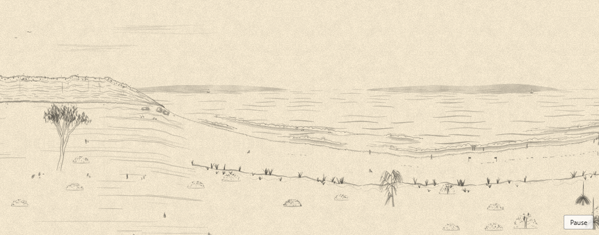

# coast-inf

A seeded, endlessly scrolling Australian coastline, drawn in ink in the browser: sea and surf, beaches and dunes, sandstone headlands, coastal bush (gums, banksias, grass trees, casuarinas, Norfolk Island pines), lighthouses, kiosks, boats and people on the sand. Every seed is a different painting, and the same seed always draws the same one.



It is a fork of [{Shan, Shui}\*](https://github.com/LingDong-/shan-shui-inf) by Lingdong Huang, which draws infinite Chinese landscape scrolls. The brushwork (`stroke`, `blob`, `texture`) and many elements are his; the coast, the engine underneath (chunk-local randomness, a worker, incremental rendering) and the embedding are new. The original landscape is still available as a scene.

## Use it

The package is not published to npm yet. Until it is, use it from this repository (`pnpm build` writes `dist/`), or import the ES modules in `src/` with any bundler.

### As an element

```html
<script type="module" src="dist/element.js"></script>

<coast-inf seed="any words" mode="drift" height="360"></coast-inf>
```

### From JavaScript

```js
import { mount } from "coast-inf";

const scene = mount(document.querySelector("#hero"), {
  seed: "any words", // default: random
  mode: "drift", // "static" | "scroll" | "drift"
  height: 400, // pixels; the width follows the element
});

scene.reseed(); // a new painting (or reseed("other words"))
scene.pause(); // drift only; play() resumes
scene.toSVG(); // the painting on screen, as an SVG file's contents
scene.destroy();
```

### Without a browser (Node, build steps)

```js
import { renderToSVG } from "coast-inf";

const svg = renderToSVG({ seed: "abc", x0: 0, x1: 3000 }); // a 3000 x 800 painting
```

### Options

| Option | Values | Default |
|--------|--------|---------|
| `seed` | any string | random |
| `mode` | `static`; `scroll` (drag, wheel or arrow keys); `drift` (a slow pan, with a pause button) | `static` |
| `height` | pixels | `400` |
| `scene` | `coast`; `upstream` (the original {Shan, Shui}\* landscape) | `coast` |
| `speed` | drift speed in world units per second | `18` |
| `label` | the text read out by screen readers | a short description |

The `<coast-inf>` element takes the same options as attributes (`seed`, `mode`, `height`, `scene`, `label`). Changing `seed` repaints.

## How it behaves on a page

- **Safe to embed.** No globals, no changes to `Math.random`, styles kept inside a shadow root. You can put several on one page.
- **Light on the page.** Painting happens in a Web Worker, so the page stays responsive. A paper-coloured placeholder shows first, then the painting fades in. A page using the element loads about 32 kB of JavaScript (gzipped). See `docs/performance.md`.
- **Accessible.** The painting is an image with a text description (`role="img"`). Drift pauses when the painting is off screen or the tab is hidden, has a visible pause button, and does not move at all for visitors who ask their system for reduced motion.
- **Black and white.** The painting is ink on paper, like the original.

## Develop

Requires Node 24 (see `.node-version`) and pnpm.

```sh
pnpm install
pnpm dev                 # demo at /demo/, the original page rebuilt on the engine at /
pnpm test                # unit, golden, browser and embedding tests
pnpm build               # library build in dist/
pnpm sheet --source modules         # contact sheet of 8 seeds (out/)
pnpm specimen gum                   # 12 variations of one element (out/)
pnpm perf:embed                     # performance of the embedded painting
```

`PLAN.md` describes how the project was built, phase by phase, with the decisions made along the way; `docs/` holds the architecture, decisions, prior art and performance records. `upstream/index.html` is the untouched original, kept as a reference.

## Licence and credit

MIT, as the original: see `LICENSE` (Lingdong Huang's copyright notice) and `NOTICE`. The landscape style, brush primitives and the original scene come from [{Shan, Shui}\*](https://github.com/LingDong-/shan-shui-inf) by Lingdong Huang. Smooth noise comes from [simplex-noise](https://github.com/jwagner/simplex-noise.js) and seeded randomness from [pure-rand](https://github.com/dubzzz/pure-rand), both MIT.

The original README follows.

---

# {Shan, Shui}*
Procedurally-generated vector-format infinitely-scrolling Chinese landscape for the browser.
Generate your own on https://lingdong-.github.io/shan-shui-inf/ (or [Alternative link](https://shan-shui-inf.glitch.me)).

Some examples:


{Shan, Shui}\* is inspired by [traditional Chinese landscape scrolls](https://en.wikipedia.org/wiki/Shan_shui) (such as [this](https://en.wikipedia.org/wiki/Dwelling_in_the_Fuchun_Mountains) and [this](https://en.wikipedia.org/wiki/Wang_Ximeng)) and uses noises and mathematical functions to model the mountains and trees from scratch. It is written entirely in javascript and outputs Scalable Vector Graphics (SVG) format.
